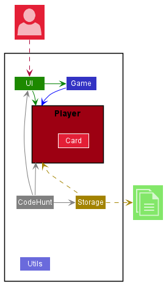
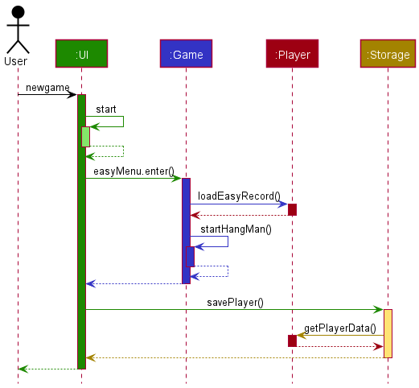
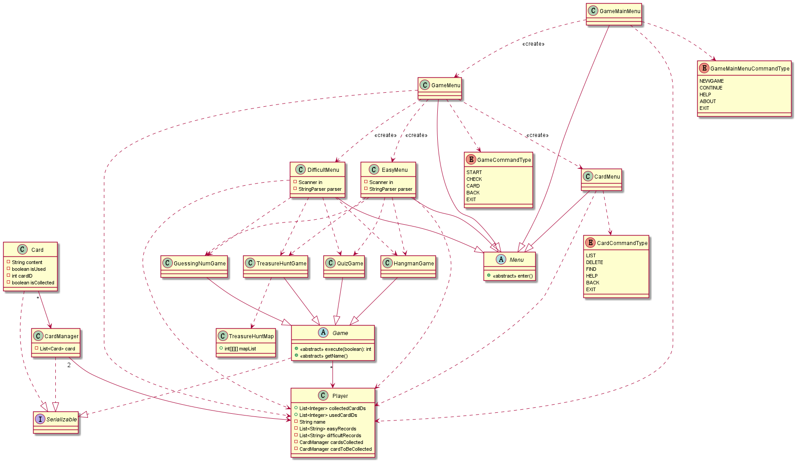
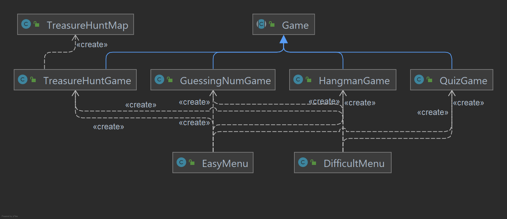
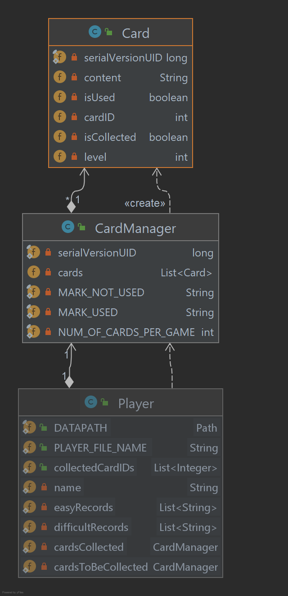
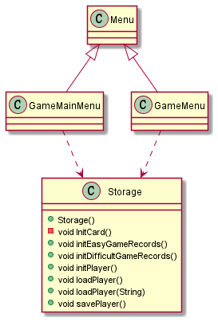
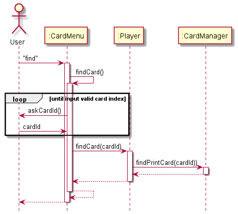
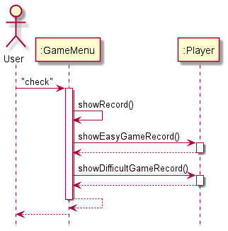

# Developer Guide

```markdown
   Hello from
        "  ____          _        _   _             _  
        " / ___|___   __| | ___  | | | |_   _ _ __ | |_ 
        "| |   / _ \\ / _` |/ _ \\ | |_| | | | | '_ \\| __|
        "| |__| (_) | (_| |  __/ |  _  | |_| | | | | |_\
        " \\____\\___/ \\__,_|\\___| |_| |_|\\__,_|_| |_|\\__|
```

- [Acknowledgements](#acknowledgements)
- [Setting up, getting started](#setting-up,-getting-started)
- [Design](#design)
    - [Architecture](#architecture)
    - [UI component](#ui-component)
    - [Game component](#game-component)
    - [Player component](#player-component)
    - [Storage component](#storage-component)
    - [Utils classes](#utils-classes)
- [Implementation](#design)
    - [Find a card](#find-a-card)
    - [Check Game History](#check-game-history)
- [Appendix: Requirements](#appendix-requirements)
  - [Product scope](#product-scope)
  - [User stories](#user-stories)
  - [Non-Functional Requirements](#non-functional-requirements)
  - [Glossary](#glossary)
  
---

## Acknowledgements
Inspiration for Developer Guide: [AddressBook (Level 3)](https://se-education.org/addressbook-level3/DeveloperGuide.html)

---

## Setting up, getting started

Refer to the guide [_Setting up and getting started_](SettingUp.md).

---

## Design

> **Tip:** The `.puml` files used to create diagrams in this document can be found in the [diagrams](https://github.com/AY2122S1-CS2113-T13-3/tp/tree/master/docs/diagrams/) folder. Refer to the [_PlantUML Tutorial_ at se-edu/guides](https://se-education.org/guides/tutorials/plantUml.html) to learn how to create and edit diagrams.


### Architecture



The ***Architecture Diagram*** given above explains the high-level design of the CodeHunt App.

Given below is a quick overview of main components and how they interact with each other.

**CodeHunt components of the architecture**

**[`CodeHunt`](https://github.com/AY2122S1-CS2113-T13-3/tp/blob/master/src/main/java/game/CodeHunt.java)** is responsible for,
* At app launch: Initializes the logger and input scanner, and calls [`GameMainMenu.java`](https://github.com/AY2122S1-CS2113-T13-3/tp/blob/master/src/main/java/ui/main/GameMainMenu.java) to enter the game.
* At shut down: Shuts down the components and invokes cleanup methods where necessary.

[**`Utils`**](#utils-classes) represents a collection of classes used by multiple other components.

The rest of the App consists of four components.

* [**`UI`**](#ui-component): The UI of the CodeHunt App. (Menu classes)
* [**`Game`**](#game-component): The games executors.
* [**`Player`**](#player-component): Holds the data of the CodeHunt App in memory.
* [**`Storage`**](#storage-component): Reads data from, and writes data to, the hard disk.

**How the architecture components interact with each other**

The *Sequence Diagram* below shows how the components interact with each other for the scenario where the user issues the command `newgame`



Each of the four main components (also shown in the diagram above),

* defines its *API* in a `package` with the same name as the Component.
* contains several levels of `class` to achieve corresponding functionality.

For example, the `Ui` component defines its API in the `ui` package and contains `GameMainMenu.java`, `GameMenu.java`, `EasyMenu.java`, `DifficultMenu.java`, `CardMenu.java`.


The sections below give more details of all the components.



### UI component

The **API** of this component is specified in [`ui`](https://github.com/AY2122S1-CS2113-T13-3/tp/tree/master/src/main/java/ui) package


The UI has a hierarchical structure. It is made up of parts e.g. `GameMainMenu.java`, `GameMenu.java` etc. All these inherit from the abstract `Menu` class which captures the commonalities between classes i.e. `enter()` method.

The `UI` component,

- [`GameMainMenu.java`](https://github.com/AY2122S1-CS2113-T13-3/tp/blob/master/src/main/java/ui/main/GameMainMenu.java)
  * loads previous player record or initializes a new player
  * starts a new game or continues previous history, thus relies on to `GameMenu.java` to execute command.
- [`GameMenu.java`](https://github.com/AY2122S1-CS2113-T13-3/tp/blob/master/src/main/java/ui/game/GameMenu.java)
  * chooses difficulty level of games then triggers `EasyMenu.java` or `DifficultMenu`.
  * checks game progress, thus depends on some classes in the `Player` component, as it displays `List<String> GameRecord` object residing in the `Player`.
  * keeps a reference to `CardMenu.java` to check and edit holding cards.
- [`EasyMenu.java`](https://github.com/AY2122S1-CS2113-T13-3/tp/blob/master/src/main/java/ui/game/EasyMenu.java)
  * implements logic flow for easy level, thus depends on some classes in the `Game` component, as it initializes and executes games.
- [`DifficultMenu.java`](https://github.com/AY2122S1-CS2113-T13-3/tp/blob/master/src/main/java/ui/game/DifficultMenu.java)
  * implements logic flow for difficult level, thus depends on some classes in the `Game` component, as it initializes and executes games.
- [`CardMenu.java`](https://github.com/AY2122S1-CS2113-T13-3/tp/blob/master/src/main/java/ui/card/CardMenu.java)
  * executes user commands using the `Card` component.
  * listens for changes to `Player` data so that the UI can be updated with the modified data, i.e. `delete card`.
  * depends on some classes in the `Player` component, as it displays / finds cards storing in the `Player` .
  
### Game component

**API** : [`game`](https://github.com/AY2122S1-CS2113-T13-3/tp/tree/master/src/main/java/data/game) package

Here's a class diagram of the `Game` component:



The `Game` component consists of `HangManGame.java`, `QuizGame.java`, `GuessingNumGame.java`, `TreasureHuntGame.java`. All these inherit from the abstract `Game` class which 
captures the commonalities between game classes, i.e. `execute(boolean isEasy)` method to enter game and `getName()` returns name of the game.

How the `Game` component works(e.g. `HangManGame`):
1. A `HangManGame` object is created in the `EasyMenu.java`, then `execute(boolean isEasy)` is called upon to run a game.
2. It initializes different variables' member in the method scope based on passing parameter `isEasy`.
5. The result of the game execution (i.e. `isWin` status) is returned to `EasyMenu.java`
* Note: Each class of game is independent.

### Player component
**API** : [`Player.java`](https://github.com/AY2122S1-CS2113-T13-3/tp/blob/master/src/main/java/data/Player.java) + [`CardManager`](https://github.com/AY2122S1-CS2113-T13-3/tp/blob/master/src/main/java/data/card/CardManager.java)



The `Player` component,

* the database of all data for one player
* stores the game records i.e., `easyRecord` and `difficultRecord` objects of `List<String>`
* stores the currently holding cards i.e., `cardsCollected` and `cardsToBeCollected` objects of `CardManager`
  - `CardManager`: All operations that player can do to a `Card` list
    - `Card`: The card with coding knowledge that a player can collect
* does not depend on any of the other three components (as the `Player` represents data entities of the domain, they should make sense on their own without depending on other components)


### Storage component

**API** : [`Storage.java`](https://github.com/AY2122S1-CS2113-T13-3/tp/blob/master/src/main/java/storage/Storage.java)



The `Storage` component,
* can save both **game history data** and **cards data** in `.dat` file, and read them back into corresponding objects.
* depends on some classes in the `Player` component (because the `Storage` component's job is to save/retrieve objects that belong to the `Player`)

### Utils classes

Classes used by multiple components are in the [`utils`](https://github.com/AY2122S1-CS2113-T13-3/tp/tree/master/src/main/java/utils) package.

- [`StringParser`](https://github.com/AY2122S1-CS2113-T13-3/tp/blob/master/src/main/java/utils/StringParser.java): Parser to parser user inputs from Ui.

- [`IO`](https://github.com/AY2122S1-CS2113-T13-3/tp/blob/master/src/main/java/utils/IO.java): The input/output formatter.

- [`Errors`](https://github.com/AY2122S1-CS2113-T13-3/tp/blob/master/src/main/java/utils/Errors.java): Show different error information.

- `Messages`: Store all the constant values that are used in this programme and shown to user
  - [`Numbers`](https://github.com/AY2122S1-CS2113-T13-3/tp/blob/master/src/main/java/utils/message/Numbers.java)
  - [`Strings`](https://github.com/AY2122S1-CS2113-T13-3/tp/blob/master/src/main/java/utils/message/Strings.java)

--------------------------------------------------------------------------------------------------------------------

## **Implementation**

This section describes some noteworthy details on how certain features are implemented.

### Find a card

Once the game starts, `GameMainMenu` class instantiates a `Player` object containing a `CardManager` object storing cards been collected by user. 
When user enters the `CardMenu` class, users can input the `find` command to start this feature.
The sequence diagram below illustrates `find()` method in `CardMenu`.



### Check Game History

Once the game starts, `GameMainMenu` class instantiates a `Player` object containing two `List<String>` object (`easyRecords` and `difficultRecords`) storing game records.
When user enters the `GameMenu` class, users can input the `check` command to start this feature. 
The sequence diagram below illustrates `check()` method in `GameMenu`.


--------------------------------------------------------------------------------------------------------------------

## **Appendix: Requirements**

### Product scope

**Target user profile**:

* aged 6 and up
* has little prior coding experience
* has an interest in discovering interests and talents in the technology field
* prefer desktop apps over other types
* prefers typing to mouse interactions
* is reasonably comfortable using CLI apps

**Value proposition**:

As digital literacy becomes increasingly important, this product is designed for preparing our next generation to be 
future-ready. It would raise children's interest in coding by simple coding tasks and help them learn some basic coding 
skills through different levels of text-based adventure games. 
It is also designed to help children to develop their logical thinking.


### User stories

| Version  | As a …​                                 | I want to …​                | So that I can…​                                                        |
| -------- | ------------------------------------------ | ------------------------------ | ---------------------------------------------------------------------- |
| `v1.0`   | student   | choose the game-level at the beginning    | choose the difficulty level of tasks by myself   |
| `v1.0`   | challenger| get cards if I pass a game level | use the cards to learn more coding related knowledge |                                                                     |
| `v1.0`   | user       | create a new game record   | play the game from the start    |
| `v1.0`   | user  | see the game progress of myself  | make sure that I have followed the instructions |
| `v1.0`   | user      | see all the holding cards  | review knowledge occasionally   |
| `v2.0`   | student | quit game ar any time  | arrange time freely   |
| `v2.0`   | student | save the game progress    | turn to do some other work and keep the game progress    |
| `v2.0`   | student | continue finishing the tasks that I left before       | avoid restarting from the beginning   |


### Non-Functional Requirements

1. Should work on any _mainstream OS_ as long as it has Java `11` or above installed.
2. A user with above average typing speed for regular English text (i.e. not code, not system admin commands) 
   should be able to accomplish most of the tasks faster using commands than using the mouse.

### Glossary

* **Mainstream OS**: Windows, Linux, Unix, OS-X