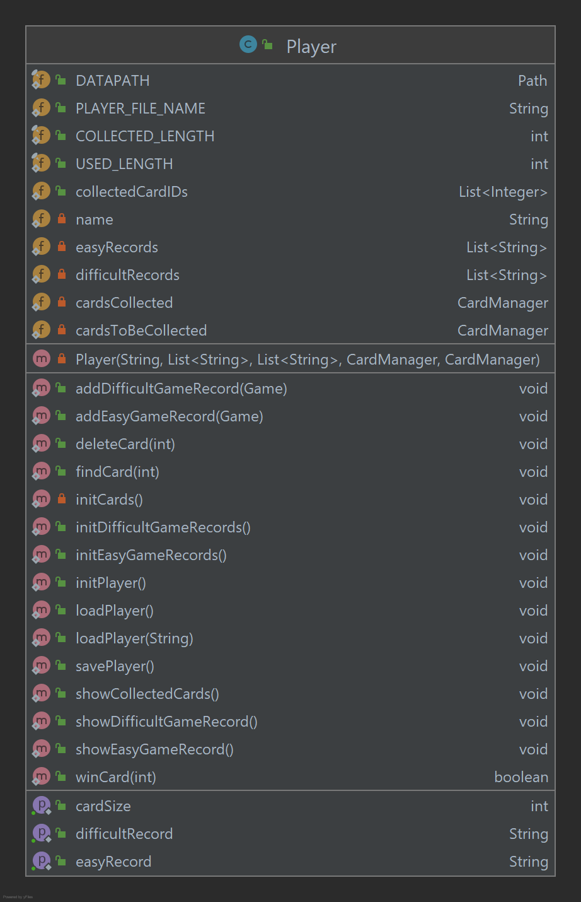

# Developer Guide

```markdown
   Hello from
        "  ____          _        _   _             _  
        " / ___|___   __| | ___  | | | |_   _ _ __ | |_ 
        "| |   / _ \\ / _` |/ _ \\ | |_| | | | | '_ \\| __|
        "| |__| (_) | (_| |  __/ |  _  | |_| | | | | |_\
        " \\____\\___/ \\__,_|\\___| |_| |_|\\__,_|_| |_|\\__|
```

- [Acknowledgements](#acknowledgements)
- [Setting up, getting started](#setting-up,-getting-started)
- [Design](#design)
    - [Architecture](#architecture)
    - [UI component](#ui-component)
    - [Logic component](#listing-all-tasks)
    - [Model component](#marking-a-task-as-done)
    - [Storage component](#locating-tasks-by-keyword)
    - [Common classes](#deleting-a-task)
- [Implementation](#design)
    - [[Proposed] Undo/redo feature](#existing-the-program)
      - [Proposed Implementation](#)
      - [Design considerations](#)
    - [[Proposed] Data archiving](#saving-the-data)
- [Appendix: Requirements](command-summary)
  - [Product scope](#product-scope)
  - [User stories](#user-stories)
  - [Non-Functional Requirements](#non-functional-requirements)
  - [Glossary](#glossary)
  
---

## Acknowledgements
Inspiration for Developer Guide: [AddressBook (Level 3)](https://se-education.org/addressbook-level3/DeveloperGuide.html)

---

## Setting up, getting started

Refer to the guide [_Setting up and getting started_](SettingUp.md).

---

## Design

<div markdown="span" class="alert alert-primary">

:bulb: **Tip:** The `.puml` files used to create diagrams in this document can be found in the [diagrams](https://github.com/AY2122S1-CS2113-T13-3/tp/tree/master/docs/diagrams/) folder. Refer to the [_PlantUML Tutorial_ at se-edu/guides](https://se-education.org/guides/tutorials/plantUml.html) to learn how to create and edit diagrams.
</div>


### Architecture


The ***Architecture Diagram*** given above explains the high-level design of the CodeHunt App.

Given below is a quick overview of main components and how they interact with each other.

**CodeHunt components of the architecture**

**[`CodeHunt`](https://github.com/AY2122S1-CS2113-T13-3/tp/blob/master/src/main/java/game/CodeHunt.java)** is responsible for,
* At app launch: Initializes the logger and input scanner, and calls [`GameMainMenu.java`](https://github.com/AY2122S1-CS2113-T13-3/tp/blob/master/src/main/java/ui/main/GameMainMenu.java) to enter the game.
* At shut down: Shuts down the components and invokes cleanup methods where necessary.

[**`Utils`**](#utils-classes) represents a collection of classes used by multiple other components.

The rest of the App consists of four components.

* [**`UI`**](#ui-component): The UI of the CodeHunt App. (Menu classes)
* [**`Game`**](#game-component): The games executors.
* [**`Player`**](#player-component): Holds the data of the CodeHunt App in memory.
* [**`Storage`**](#storage-component): Reads data from, and writes data to, the hard disk.

**How the architecture components interact with each other**

The *Sequence Diagram* below shows how the components interact with each other for the scenario where the user issues the command `delete 1`.


Each of the four main components (also shown in the diagram above),

* defines its *API* in an `interface` with the same name as the Component.
* implements its functionality using a concrete `{Component Name}Manager` class (which follows the corresponding API `interface` mentioned in the previous point.

For example, the `Logic` component defines its API in the `Logic.java` interface and implements its functionality using the `LogicManager.java` class which follows the `Logic` interface. Other components interact with a given component through its interface rather than the concrete class (reason: to prevent outside component's being coupled to the implementation of a component), as illustrated in the (partial) class diagram below.


The sections below give more details of each component.


### UI component

The **API** of this component is specified in [`ui`](https://github.com/AY2122S1-CS2113-T13-3/tp/tree/master/src/main/java/ui) package


The UI consists of a `MainWindow` that is made up of parts e.g.`CommandBox`, `ResultDisplay`, `PersonListPanel`, `StatusBarFooter` etc. All these, including the `MainWindow`, inherit from the abstract `UiPart` class which captures the commonalities between classes that represent parts of the visible GUI.

The `UI` component uses the JavaFx UI framework. The layout of these UI parts are defined in matching `.fxml` files that are in the `src/main/resources/view` folder. For example, the layout of the [`MainWindow`](https://github.com/se-edu/addressbook-level3/tree/master/src/main/java/seedu/address/ui/MainWindow.java) is specified in [`MainWindow.fxml`](https://github.com/se-edu/addressbook-level3/tree/master/src/main/resources/view/MainWindow.fxml)

The `UI` component,

* executes user commands using the `Logic` component.
* listens for changes to `Model` data so that the UI can be updated with the modified data.
* keeps a reference to the `Logic` component, because the `UI` relies on the `Logic` to execute commands.
* depends on some classes in the `Model` component, as it displays `Person` object residing in the `Model`.

- main/Game main menu: Loads previous record or initializes the components in the correct sequence, and connects them up with each other.
- game/Game menu: Chooses easy/difficult game level; Checks game progress/ achieved cards content.
- game/Easy menu, Difficult menu: Two game levels.
- card/Card menu:

### Game component

**API** : [`game`](https://github.com/AY2122S1-CS2113-T13-3/tp/tree/master/src/main/java/data/game) package

Here's a (partial) class diagram of the `Game` component:


How the `Logic` component works:
1. When `Logic` is called upon to execute a command, it uses the `AddressBookParser` class to parse the user command.
1. This results in a `Command` object (more precisely, an object of one of its subclasses e.g., `AddCommand`) which is executed by the `LogicManager`.
1. The command can communicate with the `Model` when it is executed (e.g. to add a person).
1. The result of the command execution is encapsulated as a `CommandResult` object which is returned back from `Logic`.

The Sequence Diagram below illustrates the interactions within the `Logic` component for the `execute("delete 1")` API call.


<div markdown="span" class="alert alert-info">:information_source: **Note:** The lifeline for `DeleteCommandParser` should end at the destroy marker (X) but due to a limitation of PlantUML, the lifeline reaches the end of diagram.
</div>

Here are the other classes in `Logic` (omitted from the class diagram above) that are used for parsing a user command:


How the parsing works:
* When called upon to parse a user command, the `AddressBookParser` class creates an `XYZCommandParser` (`XYZ` is a placeholder for the specific command name e.g., `AddCommandParser`) which uses the other classes shown above to parse the user command and create a `XYZCommand` object (e.g., `AddCommand`) which the `AddressBookParser` returns back as a `Command` object.
* All `XYZCommandParser` classes (e.g., `AddCommandParser`, `DeleteCommandParser`, ...) inherit from the `Parser` interface so that they can be treated similarly where possible e.g, during testing.

- `Game`: The parent class of game
- `GameRecord`: The list storing all the games completed by the user
- `QuizGame`: The game base on four forms of quiz
- `GuessingNumGame`: The guessing number game
- `TreasureHuntGame`: The treasure hunt game
- `TreasureHuntMap`: All the maps for the treasure hunt game

### Player component
**API** : [`Model.java`](https://github.com/se-edu/addressbook-level3/tree/master/src/main/java/seedu/address/model/Model.java)


The `Model` component,

* stores the address book data i.e., all `Person` objects (which are contained in a `UniquePersonList` object).
* stores the currently 'selected' `Person` objects (e.g., results of a search query) as a separate _filtered_ list which is exposed to outsiders as an unmodifiable `ObservableList<Person>` that can be 'observed' e.g. the UI can be bound to this list so that the UI automatically updates when the data in the list change.
* stores a `UserPref` object that represents the user’s preferences. This is exposed to the outside as a `ReadOnlyUserPref` objects.
* does not depend on any of the other three components (as the `Model` represents data entities of the domain, they should make sense on their own without depending on other components)

<div markdown="span" class="alert alert-info">:information_source: **Note:** An alternative (arguably, a more OOP) model is given below. It has a `Tag` list in the `AddressBook`, which `Person` references. This allows `AddressBook` to only require one `Tag` object per unique tag, instead of each `Person` needing their own `Tag` objects.<br>


</div>

**Data**:
- `Player`: The database of all data for one player
- `Card`: The card with coding knowledge that a player can collect
- `CardManager`: All operations that player can do to a card list

### Storage component

**API** : [`Storage.java`](https://github.com/se-edu/addressbook-level3/tree/master/src/main/java/seedu/address/storage/Storage.java)



The `Storage` component,
* can save both **game history data** and **cards data** in `.dat` file, and read them back into corresponding objects.
* depends on some classes in the `Player` component (because the `Storage` component's job is to save/retrieve objects that belong to the `Player`)

### Utils classes

Classes used by multiple components are in the [`utils`](https://github.com/AY2122S1-CS2113-T13-3/tp/tree/master/src/main/java/utils) package.

- [`StringParser`](https://github.com/AY2122S1-CS2113-T13-3/tp/blob/master/src/main/java/utils/StringParser.java): Parser to parser user inputs from Ui.

- [`IO`](https://github.com/AY2122S1-CS2113-T13-3/tp/blob/master/src/main/java/utils/IO.java): The input/output formatter.

- [`Errors`](https://github.com/AY2122S1-CS2113-T13-3/tp/blob/master/src/main/java/utils/Errors.java): Show different error information.

- `Messages`: Store all the constant values that are used in this programme and shown to user
  - [`Numbers`](https://github.com/AY2122S1-CS2113-T13-3/tp/blob/master/src/main/java/utils/message/Numbers.java)
  - [`Strings`](https://github.com/AY2122S1-CS2113-T13-3/tp/blob/master/src/main/java/utils/message/Strings.java)

--------------------------------------------------------------------------------------------------------------------

## **Implementation**

This section describes some noteworthy details on how certain features are implemented.

### \[Proposed\] Undo/redo feature

--------------------------------------------------------------------------------------------------------------------

## **Appendix: Requirements**

### Product scope

**Target user profile**:

* aged 6 and up
* has little prior coding experience
* has an interest in discovering interests and talents in the technology field
* prefer desktop apps over other types
* prefers typing to mouse interactions
* is reasonably comfortable using CLI apps

**Value proposition**:

As digital literacy becomes increasingly important, this product is designed for preparing our next generation to be 
future-ready. It would raise children's interest in coding by simple coding tasks and help them learn some basic coding 
skills through different levels of text-based adventure games. 
It is also designed to help children to develop their logical thinking.


### User stories

| Version  | As a …​                                 | I want to …​                | So that I can…​                                                        |
| -------- | ------------------------------------------ | ------------------------------ | ---------------------------------------------------------------------- |
| `v1.0`   | student   | choose the game-level at the beginning    | choose the difficulty level of tasks by myself   |
| `v1.0`   | challenger| get cards if I pass a game level | use the cards to learn more coding related knowledge |                                                                     |
| `v1.0`   | user       | create a new game record   | play the game from the start    |
| `v1.0`   | user  | see the game progress of myself  | make sure that I have followed the instructions |
| `v1.0`   | user      | see all the holding cards  | review knowledge occasionally   |
| `v2.0`   | student | quit game ar any time  | arrange time freely   |
| `v2.0`   | student | save the game progress    | turn to do some other work and keep the game progress    |
| `v2.0`   | student | continue finishing the tasks that I left before       | avoid restarting from the beginning   |


### Non-Functional Requirements

1. Should work on any _mainstream OS_ as long as it has Java `11` or above installed.
2. A user with above average typing speed for regular English text (i.e. not code, not system admin commands) 
   should be able to accomplish most of the tasks faster using commands than using the mouse.

### Glossary

* **Mainstream OS**: Windows, Linux, Unix, OS-X