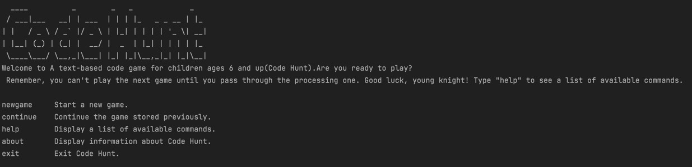
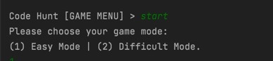

# User Guide

## Introduction

Code Hunt is a text-based adventure game using command lines for children aged 4 to 9 who have little prior coding experience but have an interest in coding to learn basic coding knowledge through playing games and collecting knowledge cards.

***

## Table of Contents
- [Quick Start](https://github.com/AY2122S1-CS2113-T13-3/tp/blob/master/docs/UserGuide.md#quick-start)
- [Features](#Features)
- []

***

## Quick Start

1. Ensure you have Java 11 or above installed in your Computer.
2. Download the latest codehunt.jar from [here](to be filled in).
3. Copy the `.jar` file to the folder you want to use as the home folder for your CodeHunt.
4. To launch the app, run the command `java -jar {filename}.jar`. Here are the first few lines you should see in the output when you start CodeHunt for the first time.

5. Type the command in the command box and press Enter to execute it. Here are some example commands you can try:
   - `help`: List all commands you can use, show their functions and examples.
   - `newgame`: initialize new game progress with a new player name
   - `continue`: continue the game with your previous player id and the corresponding game records
   - `about`: Display information about CodeHunt 
   - `exit`: Exit the game and the system will automatically save your game progress to your local file in your computer
6. If you need any help, you can refer to [this website](https://github.com/AY2122S1-CS2113-T13-3/tp/blob/master/docs/UserGuide.md) to check the User Guide


***

## Features:
### Notes:
#### Notes about command format:
* Words in `UPPER_CASE` are the parameters to be supplied by the user. e.g. the `CARD_INDEX` in `delete CARD_INDEX` is a parameter that user should provide, such as `delete 1`.
* If a parameter is expected only once in the command, but you specified it multiple times, only the last occurrence of the parameter will be taken. e.g. if you specified `delete 1 2` then it will be recognized as `delete 1` and delete the first card for you.

#### Notes about game levels in CodeHunt:
* There are 2 levels of games you can try in CodeHunt: `Easy mode`, `Difficult mode`

    * The 2 game levels contain the same games with different game content.
    * Player can choose the game level they want to challenge.
* Different game levels have different rules:
    * For `Easy mode`: Whether you win the game or not, you can choose to enter next game by choosing `continue`, or try
      this game one more time by choosing `again`, or you can exit CodeHunt and save your game records by choosing `exit`
  
    * For `Difficult mode`: Only when you win the game, you can go on to enter the next game, otherwise you will have to retry the 
      game by choosing `again` until you win, or you can exit CodeHunt by choosing `exit`.
* Win cards by winning the games
    * Every time you win a game, you will collect a card with some coding knowledge on it. You can use the cards to learn new things or buy tips in the following games.


***
    
### Main page:
```
 ____          _        _   _             _  
/ ___|___   __| | ___  | | | |_   _ _ __ | |_
| |   / _ \ / _` |/ _ \ | |_| | | | | '_ \| __|
| |__| (_) | (_| |  __/ |  _  | |_| | | | | |_
\____\___/ \__,_|\___| |_| |_|\__,_|_| |_|\__|
Welcome to A text-based code game for children ages 6 and up(Code Hunt).Are you ready to play?
Type "help" to see a list of available commands.
```

- `newgame`     Start a new game. The system will give you a string of user number that is used to continue the game next time.
  - For example below: `Lily321016718` will be your player ID, your game records will be saved here. 
```
Code Hunt [MAIN MENU] > newgame
Enter your player name: Lily
Remember your ID to continue your game next time: Lily321016718
```

    
- `continue`    Continue the game stored previously. CodeHunt will ask for you player ID here.
- `help `       Display a list of available commands.
- `about`       Display information about Code Hunt.
- `exit`        Exit Code Hunt.

***


### Intermediate page
- `start`       Start the game and then choose your difficulty level. Enter `1` for easy mode and `2` for difficult mode.
```
Code Hunt [GAME MENU] > start
Please choose your game mode: 
(1) Easy Mode | (2) Difficult Mode.
```
- `check`       Check current game progress. You will see something like this:
```
Code Hunt [GAME MENU] > check
   ____      _      __  __  U _____ u       ____    U _____ u   ____   U  ___ u   ____     ____    
U /"___|uU  /"\  uU|' \/ '|u\| ___"|/    U |  _"\ u \| ___"|/U /"___|   \/"_ \/U |  _"\ u |  _"\   
\| |  _ / \/ _ \/ \| |\/| |/ |  _|"       \| |_) |/  |  _|"  \| | u     | | | | \| |_) |//| | | |  
 | |_| |  / ___ \  | |  | |  | |___        |  _ <    | |___   | |/__.-,_| |_| |  |  _ <  U| |_| |\ 
  \____| /_/   \_\ |_|  |_|  |_____|       |_| \_\   |_____|   \____|\_)-\___/   |_| \_\  |____/ u 
  _)(|_   \\    >><<,-,,-.   <<   >>       //   \\_  <<   >>  _// \\      \\     //   \\_  |||_    
 (__)__) (__)  (__)(./  \.) (__) (__)     (__)  (__)(__) (__)(__)(__)    (__)   (__)  (__)(__)_)   
Here is you game history!
=========================================================
Here is your game record of easy level:
=========================================================
Here is your game record of difficult level:
=========================================================
```
- `card`        Manage your holding cards. You can refer to detailed introduction about `card` here [Card Page](#card page)
- `back`        Back to main menu
- `exit`        Exit Code Hunt

***

### Game page


## Games
- `Guessing Number Game`
  The game is to guess the secret number in a given range in limited attempts
- `Hangman Game`
  The game is to guess a word about coding by giving a letter every time with limited failing attempts
- `Quiz Game`
  The game is to do a mini quiz about coding containing different types of questions like MCQ, TFQ, MRQ and fill-in-blank quesitons
- `Treasure Hunt Game`
  The game is to move the treasure hunter to find the treasure noted in the map

## Card
- `winCard`
- `listCard`
- `deleteCard`
- `findCard`
- `buyTip`


## FAQ

**Q**: How do I reload my game?
=======
**A**: Remember the username given to you when you first play the game. You can reload the game by entering
this username next time.

## Command Summary

Action |  Format | Function
 ------------ | ------------- | -------------
newgame | newgame | Start a new game
continue | econtinue | Continue the game stored previously
help | help | Display a list of available commands
about | about | Display information about Code Hunt
exit | exit | Exit Code Hunt
start | start | Start the game
check | check | Check current game progress
card | card | Manage your holding cards
back | back | Back to main menu


